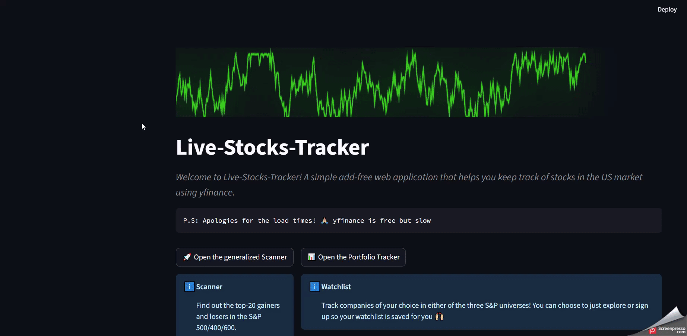

# 📉📈 Live Stocks Tracker

A simple Streamlit web-app to scan US large-, mid- and small-cap universes for the **top losers & gainers** over a customizable look-back window. Powered by [yfinance](https://pypi.org/project/yfinance/) and Wikipedia scrapes—no paid API keys required.

---
## 🚀 Features

### General Scanner
- Look at the **general scanner** - explore the 20 winners and losers in all universes! 😎
- Observe essential information for each ticker such as % change, 14-RSI and 30 day volume 🌳

### Portfolio/ Watchlist
**New!**
- Log in with gmail to create your own personalized watchlist!
- Continue anonymously if you are just looking to explore the feature!
- **More to come soon!**


---
## Scanner peak:
<!---explore scanner video --->


## Portfolio peak:
<!---explore scanner video --->


## 🚀 Getting Started

### 1. Clone this repo  
```bash
git clone https://github.com/ShekharNarayanan/live-stocks-tracker.git
cd live-stocks-tracker/src/run live_stocks_tracker
```

### 2. Install dependencies  
Create and activate a virtual environment, then install:
```bash
conda env create --file environment.portable.yml

```

### 3. Run the app  
```bash
streamlit Home.py
```
This opens a browser tab at `http://localhost:8501`.

---

## ⚙️ Configuration

- Wikipedia is scraped for ticker lists and use **yfinance** for price data.  
- No external API key needed—just install the packages.

---

---

## 🤝 Contributing

1. Fork the repo  
2. Create a feature branch:  
   ```bash
   git checkout -b feature/YourFeature
   ```  
3. Commit your changes:  
   ```bash
   git commit -am "Add YourFeature"
   ```  
4. Push to your branch:  
   ```bash
   git push origin feature/YourFeature
   ```  
5. Open a Pull Request

---

## 📝 License

Distributed under the MIT License. See [LICENSE](LICENSE) for details.


